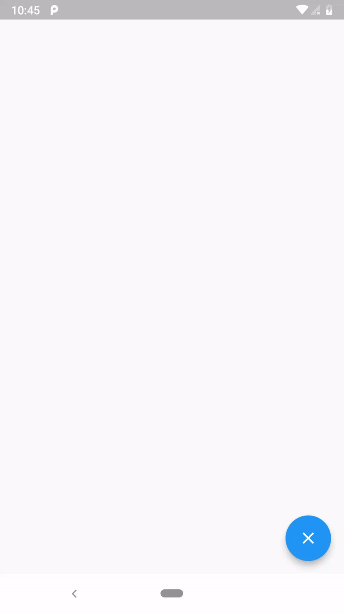

# Flutter Drawable Screen

This is a simple Demo that uses custom painter and Gesture Detector in Flutter to Doodle.

# Demo



#Config

To Change the Color of size of the stroke , etc., just edit the main.dart file

```sh
Paint paint = Paint()
      ..color = Colors.black
      ..strokeCap = StrokeCap.round
      ..strokeWidth = 5.0;
```